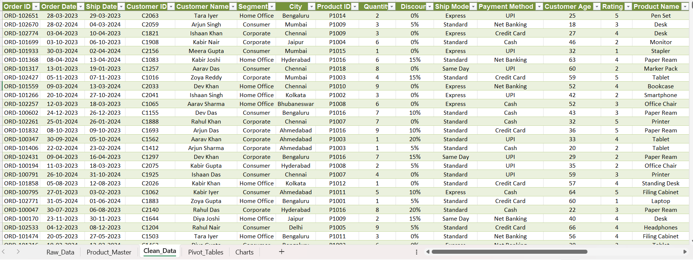
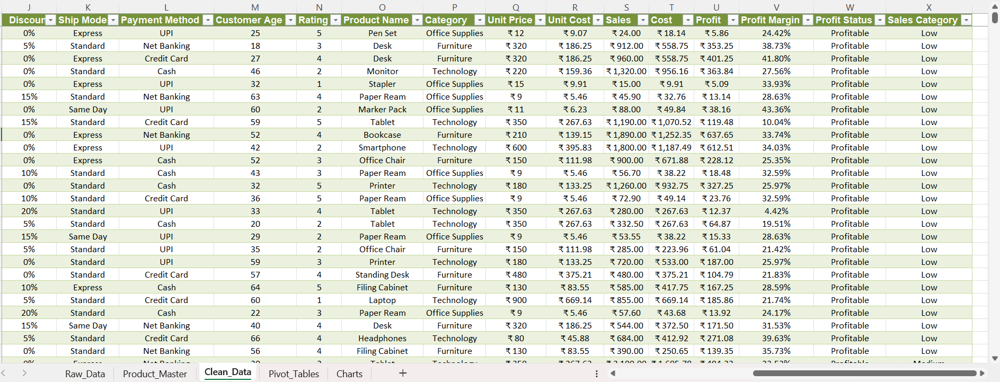
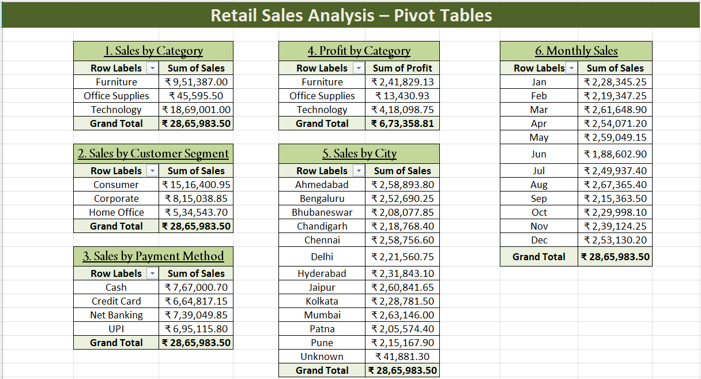
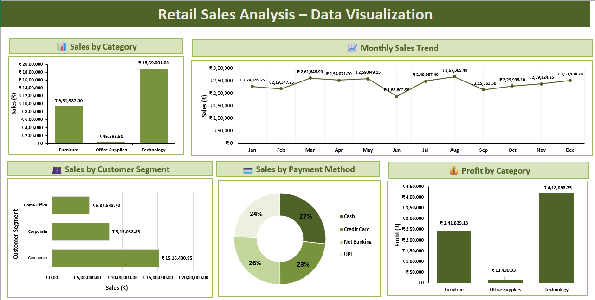
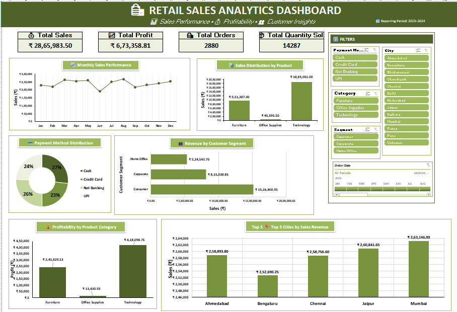

# 🛍️ Retail Sales Analysis & Interactive Dashboard | Microsoft Excel

## 📌 Project Overview

This project analyzes retail transaction data using Microsoft Excel to evaluate sales performance, product profitability, customer segments, payment preferences, monthly sales trends, and city-wise revenue.

The project follows a complete data analysis workflow, including data cleaning, product enrichment, calculated columns, PivotTables, PivotCharts, and an interactive dashboard.

The objective is to transform raw retail data into meaningful business insights that help businesses understand their performance, identify opportunities, and make data-driven decisions.

## 🎯 Business Objectives

- Analyze total sales, profit, orders, and quantity sold.
- Identify the highest-performing product categories.
- Compare revenue and profit across product categories.
- Understand monthly sales fluctuations.
- Analyze customer segment contributions.
- Examine payment method preferences.
- Identify the top five cities by sales revenue.
- Build an interactive dashboard for business performance monitoring.

---

## 📊 Project Workflow & Business Analysis

### 1. Data Cleaning and Preparation

[📷 View Clean Data Screenshot](01_Clean_Data.png)

**Business Analysis Performed**

The raw dataset was prepared by removing duplicate records, handling missing values, standardizing customer names, correcting date formats, and ensuring relevant fields were stored in appropriate data formats. The original raw data was preserved separately.

**How This Helps the Business**

- Improves data consistency and reporting reliability.
- Reduces the risk of duplicate records affecting analysis.
- Makes transaction data easier to filter and summarize.
- Creates a reliable foundation for further business analysis.

### 2. Product Enrichment and Additional Calculated Columns

[📷 View Additional Columns Screenshot](02_Clean_Data_Additional_Columns.png)

**Business Analysis Performed**

Product names, categories, unit prices, and unit costs were added using VLOOKUP and INDEX-MATCH functions. Calculated columns were created for Sales, Cost, Profit, Profit Margin, Profit Status, and Sales Category.

**How This Helps the Business**

- Calculates revenue after discounts.
- Determines the cost and profit associated with transactions.
- Helps compare profitability across products and categories.
- Shows profit margin as a percentage of sales.
- Classifies transactions into High, Medium, and Low sales categories.

These calculations provide a financial perspective on individual transactions instead of focusing only on sales volume.

### 3. PivotTables — Business Performance Summary

[📷 View PivotTables Screenshot](03_Pivot_Tables.png)

**Business Analysis Performed**

PivotTables were used to summarize the dataset from six business perspectives:

- **Sales by Category:** Compares revenue from Furniture, Office Supplies, and Technology.
- **Sales by Customer Segment:** Measures revenue from Consumer, Corporate, and Home Office customers.
- **Sales by Payment Method:** Compares Cash, Credit Card, Net Banking, and UPI sales.
- **Sales by City:** Evaluates revenue across different locations.
- **Profit by Category:** Compares profit generated by each product category.
- **Monthly Sales:** Summarizes sales revenue by month.

**Key Business Findings**

- Technology generates the highest sales revenue and profit among the three categories in the displayed results.
- Consumer customers contribute the highest revenue among the three customer segments.
- Revenue is distributed across all four payment methods.
- City-level comparisons help identify stronger and weaker sales markets.
- Monthly sales totals reveal fluctuations in revenue throughout the year.

**How This Helps the Business**

PivotTables simplify large amounts of transaction data into useful summaries. Managers can compare business performance, identify high-performing categories, understand customer contributions, and investigate sales differences across locations and months.

### 4. Data Visualization — Turning Data into Insights

[📷 View Data Visualization Screenshot](04_Data_Visualization.png)

**Business Analysis Performed**

Charts were created to present the results in a clear visual format:

- **Sales by Category:** Compares revenue across product categories.
- **Monthly Sales Trend:** Shows monthly revenue changes from January to December.
- **Sales by Customer Segment:** Compares the revenue contribution of customer groups.
- **Sales by Payment Method:** Displays the share of sales associated with each payment method.
- **Profit by Category:** Highlights category-level profitability.

**Key Business Findings**

- Technology is the leading category in sales revenue and profit in the displayed analysis.
- Consumer customers generate the highest revenue among the three segments.
- August has the highest monthly sales, while June has the lowest in the displayed chart.
- Cash has the largest share among the four payment methods in the displayed chart.

**How This Helps the Business**

Visualizations make comparisons easier to understand and communicate. They help managers identify patterns, investigate weaker sales periods, evaluate product performance, and decide where further analysis or business action may be needed.

For example, a month with lower sales could prompt an investigation into demand, promotions, stock availability, or seasonal factors.

### 5. Interactive Retail Sales Analytics Dashboard

[📷 View Dashboard Screenshot](05_Dashboard.png)

**Business Analysis Performed**

The dashboard combines key performance indicators, business charts, and interactive filters into one reporting interface.

**Key Performance Indicators (KPIs)**

- **Total Sales:** Overall sales revenue recorded in the dataset.
- **Total Profit:** Total profit calculated from sales and costs.
- **Total Orders:** Number of order records counted in the analysis.
- **Total Quantity Sold:** Total units sold across transactions.

**Dashboard Visualizations**

- Monthly Sales Performance
- Sales Distribution by Product Category
- Payment Method Distribution
- Revenue by Customer Segment
- Profitability by Product Category
- Top 5 Cities by Sales Revenue

Slicers for payment method, city, category, and customer segment, along with an Order Date timeline, allow users to explore the available data.

**Key Business Findings**

- KPI cards provide a quick overview of overall retail performance.
- Category charts identify the product groups contributing most to revenue and profit.
- Customer segment analysis highlights the groups generating the most revenue.
- The monthly trend helps identify changes in sales performance.
- The Top 5 Cities chart highlights leading cities by sales revenue
